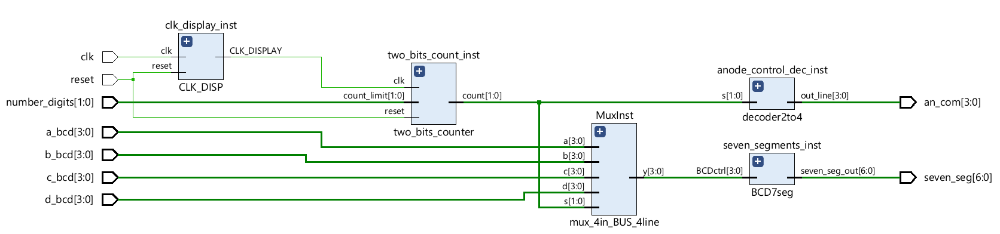
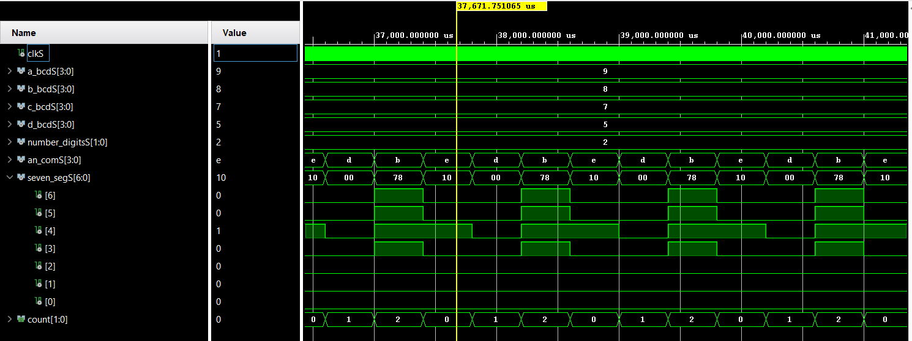

# **VHDL controller 7 segment display for BOOLEAN BOARD.**

Este proyecto muestra el desarrollo de un controlador para el display de 7 segmentos de una plaba Boolean Board, diseñada y distribuida por RealDigital, cuya web podéis encontrar en el siguiente enlace [RealDigital](https://www.realdigital.org/). En esta misma web encontraréis documentación sobre como utilizar Vivado, el IDE para la programación de esta placa y que podéis encontrar en la página de [AMD](https://www.xilinx.com/products/design-tools/vivado.html). También encontraréis documentación sobre la Boolean Board, muy util para realizar vuestros desarrollos, así como algunos ejemplos de programación de la misma en Verilog. Aunque como dice el título de esta entrada en este caso el desarrollo se va a llevar a cabo en VHDL.

El desarrollo del proyecto se va a realizar llevando a cabo un diseño gerarquizado, propio de un desarrollo/proyecto de ingenieria. Para ello, partiendo de la información facilitada por RealDigital en su página web, concretamente en la sección donde explica la implementación del [Controlador para el display de 7 Segmentos](https://www.realdigital.org/doc/586fb4c3326dcd493a5774b2a6050f41). En ella podemos encontrar un esquema de circuito para la implementación/descripción hardware en la siguiente Figura: .

En este esquema podemos observar que los diferentes componenetes tienen fondos de distinto color. Los componenetes de fondo verde corresponden a una ejemplo de aplicación en el uso del display y quedan fuera de la implementación desarrollada en este proyecto. Los componentes con fondo amarillo hacen referencia a los componentes que permiten controlar el display de 7 segmentos con 4 dígitos controlado con un único decodificador BCD a 7 segmentos. Estos componentes si son objeto del presente desarrollo. Por último, el display mostrado con fondo blanco es un componente físico que se encuentra en la placa. Placa Boolean Board cuya imágen podemos ver a continuación: 

El diseño gerarquizazo comienda por la descripción de los bloques presentes en la figura. Si bien en el contador de dos bits podemos observar que su entrada de reloj esta definida como **CLK_DISP**. En la documentación sobre el manejo del display 7 segmentos indica que esta señal de reloj debe encontrarse entre 250 Hz y 10 kHz. Al tener el reloj físico de la tarjeta una frecuencia de 100 MHz necesitaremos un divisor de frecuencia para poder conseguir la frecuencia de reloj necesaria para el manejo del display.

Por tanto, el desarrollo/descripción hardware se va a dividir en cada uno de los componentes y que se describen en documentos indivicuales. Seguidemente, se mostrará la únión de todos ellos para terminal con la conexión de los puertos del elemento de control a diferentes elementos hardware disponibles en la placa Boolean Board para la comprobaciçon del funcionamiento del sistema.

A continuación se desarrolla la descripción de los componentes de manera indivicual:

## **1. [Divisor de frecuencia para la generación del CLK_DISP en un ranto apropiado.](/freq_div_CLK_DISP.md)**

## **2. [Contador de dos bits con control de límite de cuenta.](/two_bits_counter_with_account_limit.md)**

## **3. [Multiplexor de cuatro canales de entrada, 2 líneas de control y buses de cuatro líneas por canal.](/mux4input_channels4bus_lines_channel.md)**

## **4. [Decodificador de dos canales de entrada y cuatro de salida.](/decoder2to4.md)**

## **5. [Decodificador BCD 7 segmentos.](/BCD7segments_decoder.md)**

El siguiente paso es unir todos los componentes descritos para crear el componente/subcircuito que realiza el control del display y que se corresponde con el conjunto de todos los componentes con fondo amarillo en el esquema de circuito anteriormente representado.

El código que permite unir todos los componentes es el siguiente:
```VHDL
----------------------------------------------------------------------------------
-- Company: DAC-EDESIGNER
-- Engineer: Diego Antolín Cañada
-- 
-- Create Date: 14.08.2024 11:28:04
-- Design Name:  Boolean Board 7 Segments Display controller
-- Module Name: LCD_display_controller - Behavioral
-- Project Name:  Boolean Board 7 Segments Display controller
-- Target Devices: Boolean Board 
-- Tool Versions: Vivado 2024.1
-- Description: 
-- 
-- Dependencies: Not exist
-- 
-- Revision:
-- Revision 0.01 - File Created
-- Additional Comments:
-- 
----------------------------------------------------------------------------------


library IEEE;
use IEEE.STD_LOGIC_1164.ALL;

-- Uncomment the following library declaration if using
-- arithmetic functions with Signed or Unsigned values
--use IEEE.NUMERIC_STD.ALL;

-- Uncomment the following library declaration if instantiating
-- any Xilinx leaf cells in this code.
--library UNISIM;
--use UNISIM.VComponents.all;

entity LCD_display_controller is
    Port ( clk : in STD_LOGIC;
           reset: in STD_LOGIC;
           a_bcd : in STD_LOGIC_VECTOR (3 downto 0);
           b_bcd : in STD_LOGIC_VECTOR (3 downto 0);
           c_bcd : in STD_LOGIC_VECTOR (3 downto 0);
           d_bcd : in STD_LOGIC_VECTOR (3 downto 0);
           number_digits : in STD_LOGIC_VECTOR (1 downto 0);
           an_com : out STD_LOGIC_VECTOR (3 downto 0);
           seven_seg : out STD_LOGIC_VECTOR (6 downto 0)
           );
           
end LCD_display_controller;

architecture Behavioral of LCD_display_controller is

component CLK_DISP
    port (
       clk : in STD_LOGIC;
       reset : in STD_LOGIC;
       CLK_DISPLAY : out STD_LOGIC
    );
end component;

component two_bits_counter
    port (
           clk : in STD_LOGIC;
           reset : in STD_LOGIC;
           count_limit: in STD_LOGIC_VECTOR (1 downto 0);
           count : out STD_LOGIC_VECTOR (1 downto 0)
    );
end component;

component decoder2to4
    port (
           s : in STD_LOGIC_VECTOR (1 downto 0);
           out_line : out STD_LOGIC_VECTOR (3 downto 0)
    );
end component; 

component mux_4in_BUS_4line
    port (
           a : in STD_LOGIC_VECTOR (3 downto 0);
           b : in STD_LOGIC_VECTOR (3 downto 0);
           c : in STD_LOGIC_VECTOR (3 downto 0);
           d : in STD_LOGIC_VECTOR (3 downto 0);
           s : in STD_LOGIC_VECTOR (1 downto 0);
           y : out STD_LOGIC_VECTOR (3 downto 0)
    );
end component; 
 
component BCD7seg
port (
   BCDctrl : in STD_LOGIC_VECTOR (3 downto 0);
   seven_seg_out : out STD_LOGIC_VECTOR (6 downto 0)
);
end component;

--Common signals
signal clkS, resetS : std_logic;

-- Clock display signals
signal CLK_DISPLAYS : std_logic;

 -- Two Bits Counter signals.
signal countS, count_limitS:std_logic_vector(1 downto 0):= "00";

--decoder signals
signal out_lineS : std_logic_vector(3 downto 0):= "0000";

-- Mulpliplexer signals
signal aS,bS,cS,dS : std_logic_vector(3 downto 0) := (others => '0');
signal yS : std_logic_vector(3 downto 0) := (others => '0');

-- SevenSegments signals
signal seven_seg_outS : std_logic_vector(6 downto 0);

begin
-- Instantiate clock display
clk_display_inst: CLK_DISP 
    port map 
    (
        reset => resetS,
        clk => clk,
        CLK_DISPLAY => CLK_DISPLAYS
    );
    
-- Instantiate two bits counter
two_bits_count_inst: two_bits_counter -- unit under test
    port map 
    (
        clk => CLK_DISPLAYS,
        reset =>resetS,
        count_limit => count_limitS,
        count => countS
    );

-- Instantiate anode control display
anode_control_dec_inst: decoder2to4 -- unit under test
    port map 
    (
        s => countS,
        out_line => out_lineS
    );

-- Instantiate 4 channels 4 line bus multiplexter
MuxInst: mux_4in_BUS_4line
    port map 
    (
        a => aS,
        b => bS,
        c => cS,
        d => dS,
        s => countS,
        y => yS    
    );

-- Instantiate BCD 7 segments decoder
seven_segments_inst: BCD7seg  
    port map 
    (
        BCDctrl => yS,
        seven_seg_out => seven_seg_outS
    );

seven_seg <= seven_seg_outS;
an_com <= out_lineS;
count_limitS <= number_digits;
resetS <=reset;
aS <= a_bcd;
bS <= b_bcd;
cS <= c_bcd;
dS <= d_bcd;

end Behavioral;
```

El esquema que representa el componenede descrito en el código anterior y que genera el entorno de desarrollo Vivado es el siguiente.


El uso del visor de esquema puede ser interesante y relevante a la hora de buscar errores en las conexiones y resolver problemas de funcionamiento por no haber descrito la conexión de los componentes de la forma apropiada.

Mientras que el código que permite realizar al simulación es el siguiente:
```VHDL
----------------------------------------------------------------------------------
-- Company: DAC-EDESIGNER
-- Engineer: Diego Antolín Cañada
-- 
-- Create Date: 14.08.2024 12:03:01
-- Design Name:  Boolean Board 7 Segments Display controller
-- Module Name: tb_LCD_display_controller - Behavioral
-- Project Name:  Boolean Board 7 Segments Display controller
-- Target Devices: Boolean Board 
-- Tool Versions: Vivado 2024.1
-- Description: 
-- 
-- Dependencies: LCD_display_controller.vhd
-- 
-- Revision: 1.0
-- Revision 0.01 - File Created
-- Additional Comments:
-- 
----------------------------------------------------------------------------------


library IEEE;
use IEEE.STD_LOGIC_1164.ALL;

-- Uncomment the following library declaration if using
-- arithmetic functions with Signed or Unsigned values
--use IEEE.NUMERIC_STD.ALL;

-- Uncomment the following library declaration if instantiating
-- any Xilinx leaf cells in this code.
--library UNISIM;
--use UNISIM.VComponents.all;

entity tb_LCD_display_controller is
--  Port ( );
end tb_LCD_display_controller;

architecture Behavioral of tb_LCD_display_controller is

component LCD_display_controller
    port (
           clk : in STD_LOGIC;
           reset: in STD_LOGIC;
           a_bcd : in STD_LOGIC_VECTOR (3 downto 0);
           b_bcd : in STD_LOGIC_VECTOR (3 downto 0);
           c_bcd : in STD_LOGIC_VECTOR (3 downto 0);
           d_bcd : in STD_LOGIC_VECTOR (3 downto 0);
           number_digits : in STD_LOGIC_VECTOR (1 downto 0);
           an_com : out STD_LOGIC_VECTOR (3 downto 0);
           seven_seg : out STD_LOGIC_VECTOR (6 downto 0)
    );
end component;

-- Stimulus Input Signals
signal clkS : STD_LOGIC := '0';
signal resetS: STD_LOGIC := '0';
signal a_bcdS : STD_LOGIC_VECTOR (3 downto 0):= (others => '0');
signal b_bcdS : STD_LOGIC_VECTOR (3 downto 0):= (others => '0');
signal c_bcdS : STD_LOGIC_VECTOR (3 downto 0):= (others => '0');
signal d_bcdS : STD_LOGIC_VECTOR (3 downto 0):= (others => '0');
signal number_digitsS : STD_LOGIC_VECTOR (1 downto 0):= (others => '1');


-- Stimulus Outputs Signals
signal an_comS : STD_LOGIC_VECTOR (3 downto 0);
signal seven_segS : STD_LOGIC_VECTOR (6 downto 0);


begin
uut: LCD_display_controller -- unit under test
    port map 
    (
        clk => clkS,
        reset => resetS,
        a_bcd => a_bcdS,
        b_bcd => b_bcdS,
        c_bcd => c_bcdS,
        d_bcd => d_bcdS,
        number_digits => number_digitsS,
        an_com => an_comS,
        seven_seg => seven_segS
    );
    
    --clock signal definition
    clkS <= NOT clkS AFTER 1 ns;
    
    -- Stimulus process
    stim_proc: process
    begin
        a_bcdS <= "1001";
        b_bcdS <= "1001";
        c_bcdS <= "1001";
        d_bcdS <= "1001";
        resetS <= '0';
        number_digitsS <= "10";
        wait for 10 ms;
        a_bcdS <= "1001";
        b_bcdS <= "1000";
        c_bcdS <= "0111";
        d_bcdS <= "0101";
        wait for 10 ms;
        a_bcdS <= "1001";
        b_bcdS <= "1000";
        c_bcdS <= "0111";
        d_bcdS <= "0101";
        wait for 10 ms;
        a_bcdS <= "1001";
        b_bcdS <= "1000";
        c_bcdS <= "0111";
        d_bcdS <= "0101";
        wait for 10 ms;
        a_bcdS <= "1001";
        b_bcdS <= "1000";
        c_bcdS <= "0111";
        d_bcdS <= "0101";
        wait for 10 ms;
        
        a_bcdS <= "1001";
        b_bcdS <= "1001";
        c_bcdS <= "1001";
        d_bcdS <= "1001";
        resetS <= '0';
        number_digitsS <= "11";
        wait for 10 ms;
        a_bcdS <= "1001";
        b_bcdS <= "1000";
        c_bcdS <= "0111";
        d_bcdS <= "0101";
        wait for 10 ms;
        a_bcdS <= "1001";
        b_bcdS <= "1000";
        c_bcdS <= "0111";
        d_bcdS <= "0101";
        wait for 10 ms;
        a_bcdS <= "1001";
        b_bcdS <= "1000";
        c_bcdS <= "0111";
        d_bcdS <= "0101";
        wait for 10 ms;
        a_bcdS <= "1001";
        b_bcdS <= "1000";
        c_bcdS <= "0111";
        d_bcdS <= "0101";
        wait for 10 ms;
        
    end process;

end Behavioral;
```

La siguiente figura muestra la simulación del controlador del display:


Dado que el circuito esta pensado para su uso con la placa de desarrollo Boolean Board podría haber sido interesante realizar directamente la conexión a los elementos físicos conectados en la tarjeta a la FPGA siguiendo las restricciones (constrain) proporcionadas por RealDigital [aquí](https://www.realdigital.org/downloads/8d5c167add28c014173edcf51db78bb9.txt). Pero esto haría que el componente no fuera reutilizable.

Esta tarjeta Boolean Board dispone de dos displays 7 segmentos de cuatro digitos cada uno. Cada uno de ellos se controla de forma independiente. Describir el componente y sus conexiones de manera genérica nos permite poder utilizar la misma descripción para controlar ambos dispositivos físicos sin más que realizar dos instancias del componente y realizar la conexión a los componentes físicos que sean necesarios. O bien a otros circuitos.

La doble instancia para el control de los dos displays queda fuera de los propositos de este proyecto y por ello se deja a parte.

Finalmente, se han conectado los puertos del controlador LCD descrito en VHDL con los puertos físicos de la FPGA que están conectados a los componentes de la tarjeta Boolean Board.

En la descripción, para controlar los valores de los números BCD introducidos a través del multiplexor se han utilizado los interruptores, con el orden que se indica en el propio código VHDL.
```VHDL
a_bcd => sw(3 downto 0),
b_bcd => sw(7 downto 4),
c_bcd => sw(11 downto 8),
d_bcd => sw(15 downto 12),      
```

El reset se ha conectado al botón 0, mientras que los selectores del número de digitos a encender son el botón 1 y 2 con el código que se muestra a continuación.

```VHDL
number_digitsS(0) <= btn(1);
number_digitsS(1) <= btn(2);
```


```VHDL
----------------------------------------------------------------------------------
-- Company: DAC-EDESIGNER 
-- Engineer: Diego Antolín Cañada 
-- 
-- Create Date: 14.08.2024 13:29:46
-- Design Name: Boolean Board 7 Segments Display controller
-- Module Name: boolean_FPGA_connection - Behavioral
-- Project Name: Boolean Board 7 Segments Display controller
-- Target Devices: Boolean Board
-- Tool Versions: Vivado 2024.1
-- Description: 
-- 
-- Dependencies: Not exist
-- 
-- Revision:
-- Revision 0.01 - File Created
-- Additional Comments:
-- 
----------------------------------------------------------------------------------


library IEEE;
use IEEE.STD_LOGIC_1164.ALL;

-- Uncomment the following library declaration if using
-- arithmetic functions with Signed or Unsigned values
--use IEEE.NUMERIC_STD.ALL;

-- Uncomment the following library declaration if instantiating
-- any Xilinx leaf cells in this code.
--library UNISIM;
--use UNISIM.VComponents.all;

entity boolean_FPGA_connection is
  Port (    clk : in STD_LOGIC;
            sw : in STD_LOGIC_VECTOR (15 downto 0);
            btn : in STD_LOGIC_VECTOR (3 downto 0);
            D0_SEG : out STD_LOGIC_VECTOR (7 downto 0);
            D0_AN : out STD_LOGIC_VECTOR (3 downto 0)   
        );
end boolean_FPGA_connection;

architecture Behavioral of boolean_FPGA_connection is

component LCD_display_controller
    port (
           clk : in STD_LOGIC;
           reset: in STD_LOGIC;
           a_bcd : in STD_LOGIC_VECTOR (3 downto 0);
           b_bcd : in STD_LOGIC_VECTOR (3 downto 0);
           c_bcd : in STD_LOGIC_VECTOR (3 downto 0);
           d_bcd : in STD_LOGIC_VECTOR (3 downto 0);
           number_digits : in STD_LOGIC_VECTOR (1 downto 0);
           an_com : out STD_LOGIC_VECTOR (3 downto 0);
           seven_seg : out STD_LOGIC_VECTOR (6 downto 0)
    );
end component;


signal clkS: STD_LOGIC;
signal resetS: STD_LOGIC;
signal number_digitsS : STD_LOGIC_VECTOR (1 downto 0);
signal an_comS : STD_LOGIC_VECTOR (3 downto 0);
signal seven_segS : STD_LOGIC_VECTOR (6 downto 0);

begin

LCD_controller_Inst : LCD_display_controller
port map 
    (
        clk => clkS,
        reset =>resetS,
        a_bcd => sw(3 downto 0),
        b_bcd => sw(7 downto 4),
        c_bcd => sw(11 downto 8),
        d_bcd => sw(15 downto 12),
        number_digits => number_digitsS,
        an_com => an_comS,
        seven_seg => seven_segS
    );

resetS <= btn(0);
number_digitsS(0) <= btn(1);
number_digitsS(1) <= btn(2);
clkS <= clk;
D0_SEG (6 downto 0) <= seven_segS;
D0_SEG (7)<='1'; -- To turn off the decimal point on display
D0_AN <= an_comS;

end Behavioral;


```
Todos los códigos utilizados en este proyecto se pueden encontrar en la carpeta [vhdl_codes](vhdl_codes/)

&copy; Diego Antolín Cañada

[](https://creativecommons.org/licenses/by-sa/4.0/)