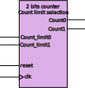

# **Contador de 2 bits con límite de cuenta programable.**

Como se puede apreciar la documentación sonbre el cómo desarrollar el [controlador para el display de 7 Segmentos](https://www.realdigital.org/doc/586fb4c3326dcd493a5774b2a6050f41) este contador permite controlar tanto el multiplexor como el decodificador que se representan en el siguiente esquema: 


De esta manera, con un único decodificador de 7 segmentos podemos mostrar información en los cuatro dígitos del display, tal como se refleja en esquema anterior.

Sin embargo, siguiendo este esquema, siempre es necesario que los que los cuatro displays se encuentren encendido. Aunque tal y como esta descrito el [decodificador de y segmentos](BCD7segments_decoder.md) solo sería necesario introducir un dato no valido para que los ledes del display se encontraran apagados. Aunque esta opción, aunque funcional carece de cierto sentido lógico.

Por ello, se ha relizado una pequeña modificación en el contador de dos bits y se han añadido dos entradas de selección que permiten definir el límite de cuenta, de manera que solo se activen los displays necesarios utilizando el selector.

El símbolo del componenete queda de la siguiente manera:


El código que describe enl comportamiento del componente es el siguiente:

```VHDL
----------------------------------------------------------------------------------
-- Company: DAC-EDESIGNER
-- Engineer: Diego Antolín Cañada
-- 
-- Create Date: 13.08.2024 23:49:49
-- Design Name:  Boolean Board 7 Segments Display controller
-- Module Name: two_bits_counter - Behavioral
-- Project Name:  Boolean Board 7 Segments Display controller
-- Target Devices: Boolean Board 
-- Tool Versions: Vivado 2024.1
-- Description: 
-- 
-- Dependencies: Not exits
-- 
-- Revision:
-- Revision 0.01 - File Created
-- Additional Comments:
-- 
----------------------------------------------------------------------------------


library IEEE;
use IEEE.STD_LOGIC_1164.ALL;

-- Uncomment the following library declaration if using
-- arithmetic functions with Signed or Unsigned values
--use IEEE.NUMERIC_STD.ALL;

-- Uncomment the following library declaration if instantiating
-- any Xilinx leaf cells in this code.
--library UNISIM;
--use UNISIM.VComponents.all;
use IEEE.STD_LOGIC_UNSIGNED.ALL;

entity two_bits_counter is
    Port ( clk : in STD_LOGIC;
           reset : in STD_LOGIC;
           count_limit : in STD_LOGIC_VECTOR (1 downto 0);
           count : out STD_LOGIC_VECTOR (1 downto 0));
end two_bits_counter;

architecture Behavioral of two_bits_counter is

--This constant can be used to set the count limit value in a fixed way, for this purpose it is necessary to comment out the input port count_limit
--constant count_limit : std_logic_vector(1 downto 0) := "01"; 

signal countS: std_logic_vector(1 downto 0);

begin

process(clk,reset)
    begin
        if (reset = '1') then
            countS <= "00";
        elsif( clk'event and clk = '1') then           
            if (countS < count_limit) then
                countS <= countS + "01";
            else
                countS <= "00";
            end if;    
        end if;
    end process;
count <= countS;

end Behavioral;
```

El código del test bench utilizado para la simulación del componente anteriormente descrito es el siguiente:


```VHDL
----------------------------------------------------------------------------------
-- Company: DAC-EDESIGNER
-- Engineer: Diego Antolín Cañada
-- 
-- Create Date: 13.08.2024 20:23:40
-- Design Name:  Boolean Board 7 Segments Display controller
-- Module Name: tb_two_bits_counter - Behavioral
-- Project Name:  Boolean Board 7 Segments Display controller
-- Target Devices: Boolean Board 
-- Tool Versions: Vivado 2024.1
-- Description: 
-- 
-- Dependencies: two_bits_counter.vhd
-- 
-- Revision: 1.0
-- Revision 0.01 - File Created
-- Additional Comments:
-- 
----------------------------------------------------------------------------------


library IEEE;
use IEEE.STD_LOGIC_1164.ALL;

-- Uncomment the following library declaration if using
-- arithmetic functions with Signed or Unsigned values
--use IEEE.NUMERIC_STD.ALL;

-- Uncomment the following library declaration if instantiating
-- any Xilinx leaf cells in this code.
--library UNISIM;
--use UNISIM.VComponents.all;

entity tb_two_bits_counter is
--  Port ( );
end tb_two_bits_counter;

architecture Behavioral of tb_two_bits_counter is

component two_bits_counter
    port (
           clk : in STD_LOGIC;
           reset : in STD_LOGIC;
           count_limit: in STD_LOGIC_VECTOR (1 downto 0);
           count : out STD_LOGIC_VECTOR (1 downto 0)
    );
end component; 

 -- Stimulus inputs   
signal resetS,clkS: std_logic := '0';

-- Stimulus outputs
signal countS, count_limitS:std_logic_vector(1 downto 0):= "00";
    
begin
uut: two_bits_counter -- unit under test
    port map 
    (
        clk => clkS,
        reset =>resetS,
        count_limit => count_limitS,
        count => countS
    );
    
    --clock signal definition
    clkS <= NOT clkS AFTER 10 ns;
    
    -- Stimulus process
    stim_proc: process
    begin
        resetS <= '1';
        count_limitS <= "11";
        wait for 100 ns;
        count_limitS <= "01";
        wait for 100 ns;
    end process;

end Behavioral;
```

Aunque los tiempos del reloj no coincide con la del reloj **CLK_DISP** que es el que va a controlar la acción de este componente. En este caso, no es relevante ya que no afecta al modo de cuenta pero si al tiempo de simulación, haciendo que de esta forma el tiempo de simulación necesario sea menor. Para hacerlo funcionar con los tiempos reales sería necesario que sustituir la línea:
```VHDL
clkS <= NOT clkS AFTER 10 ns;
```
por
```VHDL
clkS <= NOT clkS AFTER 1 ms;
```

&copy; Diego Antolín Cañada

[](https://creativecommons.org/licenses/by-sa/4.0/)